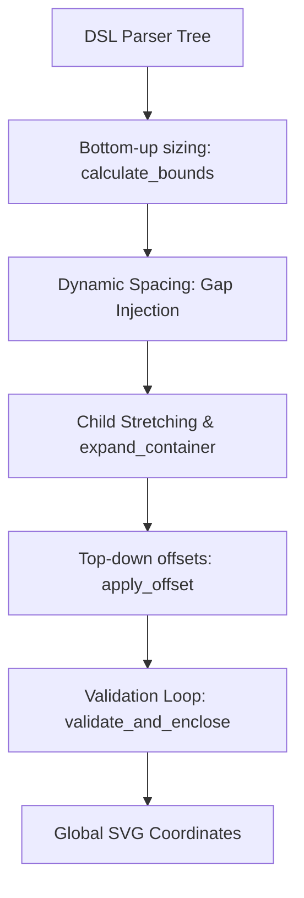

# archDraw Layout & Routing Algorithm Specifications

This document describes the algorithms and technical implementations used by `archDraw` to position diagram elements (nodes and containers) and route orthogonal, non-overlapping connections between them.

---

## 1. Node Placement Algorithm (Layout Engine)

The layout engine in [`engine.py`](file:///home/jan/Projects/archDraw/src/archDraw/layout/engine.py) computes diagram coordinates using a tree-structured, bottom-up and top-down hierarchical pass.

### Bottom-Up Size Bounds Pass (`calculate_bounds`)
1. **Leaf Nodes**: Sized based on their content, wrapping parameters, and theme assets (e.g. icon width/height).
2. **Containers**: Sums child sizes recursively along the layout direction (`horizontal` or `vertical`).
   - If a container holds any child node with `::` or `icon::` in its type, layout defaults to `horizontal` automatically.
3. **Dynamic Spacing (Gap Injection)**:
   - Evaluates connections crossing between adjacent sibling elements or sub-containers.
   - If a crossing is detected, the gap spacing is dynamically widened from the default `15px` to `50px` to pre-allocate routing corridors.
4. **Child Stretching & Realignment (`expand_container`)**:
   - If a container is stretched (e.g. to match the width of a wider sibling in a vertical stack), size adjustments are propagated down to nested children recursively.
   - Children positions are updated relative to the new container boundaries.

### Top-Down Coordinate Offset Pass (`apply_offset`)
- Recursively translates local child coordinates into global canvas coordinates $(x, y)$.

### Parent Boundary Validation Loop (`validate_and_enclose`)
- Runs bottom-up after global offsets are set.
- Calculates the bounding boxes of all children and ensures they lie within the parent's padding bounds.
- If any child extends beyond the border, the parent container is dynamically expanded to enclose it.

---

## 2. Connection Routing Algorithm (Soft Cost-Map A* Pathfinder)

The connection routing engine in [`grid_routing.py`](file:///home/jan/Projects/archDraw/src/archDraw/render/grid_routing.py) routes orthogonal, obstacle-avoiding lines using A* search on a discretized 10px grid.

### Priorities & Soft Cost-Map Matrix
Instead of strictly blocking grid cells, obstacles are represented in a soft cost-map to allow optimal routing and prevent pathfinding failures on tight layouts. Step costs are added as follows:

| Constraint / Priority | Cost Penalty | Rationale / Rule |
| :--- | :--- | :--- |
| **Priority 1: Orthogonal Lines** | Impassable | Neighbors are restricted to 90-degree orthogonal movements only. |
| **Priority 2: Orthogonal Port Exit/Entry** | Enforced | The first and last steps of the grid path are strictly constrained to the port's exit/entry directions. |
| **Priority 3: Node Bounding Boxes** | `+10000` | High penalty to prevent lines from crossing leaf Node boundaries. |
| **Priority 4: Sibling Containers** | `+5000` | Sibling containers at the same hierarchy are penalized to prevent lines from crossing through parallel boxes. |
| **Priority 5: Container Textboxes** | `+3000` | Horizontal textbox crossings are penalized (vertical crossings are free). |
| **Priority 6: Overlap Prevention** | `+1500` | Previously routed connection coordinates receive a penalty to prevent line overlaps. |
| **Priority 7: Bend Penalty** | `+150` | Large penalty for direction changes to prioritize fewer bends over short line length. |

### Smart Port & Axis Selection
1. **Fractional Candidates**: Generates port options at discrete fraction boundaries: $1/2, 3/8, 5/8, 1/4, 3/4, 1/8, 7/8$, applying soft cost penalties ($0, 5, 15, 30$) for sliding away from the center.
2. **Direct Connection Bonus**: If a port pair can be connected by a direct, unblocked straight vertical or horizontal line, it receives a `-1000` bonus.
3. **Axis-Alignment Penalty**: A penalty of `+60` is applied to port selections that do not match the main orientation axis of the connection (preferring top/bottom ports for vertically separated nodes, and left/right ports for horizontally separated nodes).
4. **Short Connection Penalty**: If a connection is shorter than the grid size ($10\text{px}$), it receives a `+200` penalty to discourage direct visual clipping.
5. **Nesting Penalty**: If a nested container connects to its child, horizontal ports receive a `+80` penalty to steer connections vertically.

### Pathfinding, Simplification & fallbacks
- **A* Search**: Finds the path that minimizes total cost (length + bends + obstacle penalties).
- **Simplification**: Combines collinear segments into simplified orthogonal lines.
- **Symmetrical Midpoint Centering**: For 3-segment (2-bend) paths, targets the exact midpoint between the start and end port coordinates (clamped to the free obstacle range) to split the lengths of the segments evenly and symmetrically.
- **Fallback**: If A* fails, routes using Manhattan routing (ignores obstacles but guarantees strictly orthogonal path segments).
