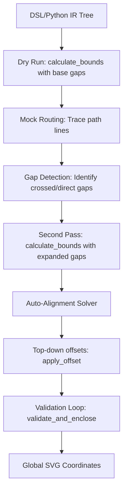

# archDraw Layout & Routing Algorithm Specifications

This document describes the algorithms and technical implementations used by `archDraw` to position diagram elements (nodes and containers) and route orthogonal, non-overlapping connections between them.

---

## 1. Node Placement Algorithm (Layout Engine)

The layout engine in [`engine.py`](file:///home/jan/Projects/archDraw/src/archDraw/layout/engine.py) computes diagram coordinates using a multi-pass hierarchical strategy.

### Hierarchical Bounds Calculation (`calculate_bounds`)
The size of elements is computed recursively starting from the leaf nodes:
1. **Leaf Nodes**: Sized based on content, wrapping parameters, font size, padding, margins, and theme assets (e.g., standard GCP icon width/height).
2. **Containers**: Sized to enclose all children recursively along the container's layout direction (`horizontal` or `vertical`).
   - If a container holds any child node with `::` or `icon::` in its type, its layout mode automatically defaults to `horizontal`.

### Connection-Aware Gap Injection
To prevent connection lines from overlapping node text or clipping boundaries, the layout engine uses a multi-pass feedback loop:
1. **Dry Run**: Computes element coordinates with default spacing/margins.
2. **Trace Paths**: Runs mock routing (A* or Manhattan) based on temporary locations.
3. **Gap Detection**: Detects which gaps between adjacent siblings or child containers are crossed by routed connection lines.
4. **Gap Injection**: Expands those crossed gaps dynamically to allocate routing corridors before final placement.

### Auto-Alignment Solver
To ensure clean visual paths:
- Elements connected directly to each other are evaluated for alignment along their connection axis.
- If the offset is within a defined threshold, an optimization step shifts elements relative to each other within their allowed alignment budget.
- This creates clean, aligned rows/columns where possible.

### Parent Boundary Validation Loop (`validate_and_enclose`)
- Translates coordinates into global space via `apply_offset`.
- Recursively checks bounding boxes bottom-up to ensure nested children fit perfectly within the parent container's padding.
- Expands parent boundaries dynamically if any child extends past container walls.

---

## 2. Connection Routing Algorithm (Soft Cost-Map A* Pathfinder)

The connection routing engine in [`grid_routing.py`](file:///home/jan/Projects/archDraw/src/archDraw/render/grid_routing.py) routes orthogonal, obstacle-avoiding lines using A* search on a discretized grid (default 10px).

### Priorities & Soft Cost-Map Matrix
Obstacles are modeled in a soft cost-map to guarantee pathfinding success in congested areas while penalizing undesirable layouts:

| Constraint / Priority | Cost Penalty | Rationale / Rule |
| :--- | :--- | :--- |
| **Orthogonal Movement** | Impassable | Neighbors are restricted to 90-degree orthogonal directions. |
| **Port Exit/Entry** | Enforced | First and last steps are constrained to the port's exit/entry directions. |
| **Node Bounding Boxes** | `+10000` | Avoids routing through leaf nodes. |
| **Sibling Containers** | `+5000` | Avoids routing through parallel box hierarchies. |
| **Container Textboxes** | `+3000` | Penalizes crossing container label boundaries. |
| **Overlap Prevention** | `+1500` | Avoids drawing overlapping lines. |
| **Bend Penalty** | `+150` | Prioritizes straight lines and fewer turns. |

### Port & Axis Selection
1. **Fractional Port Candidates**: Generates multiple connection ports at discrete fraction intervals along an element's border ($1/2, 3/8, 5/8, 1/4, 3/4, 1/8, 7/8$), applying minor penalties for off-center ports.
2. **Direct Connection Bonus**: Applies a `-1000` bonus if a straight, obstacle-free line can connect two ports directly.
3. **Axis-Alignment Penalty**: Penalizes port configurations that run counter to the dominant axis of separation.

### Path Simplification & Fallbacks
- **A* Search**: Computes the path minimizing total length and routing cost penalties.
- **Simplification**: Post-processes raw grid points to build simplified, straight line segments.
- **Symmetrical Midpoint Centering**: Positions 3-segment paths centered symmetrically between connection endpoints.
- **Manhattan Fallback**: If A* search cannot find a valid path due to blockage, routes using standard Manhattan routing (ignoring obstacles to guarantee a connection is always rendered).
