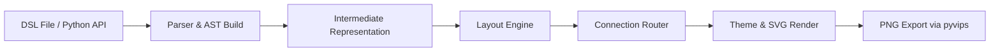

# archDraw Architecture & Design Specification

This document details the file structure, architecture pipeline, and history of architectural decisions for **archDraw**.

---

### 1. Project File Structure

`archDraw` uses a modern Python `src/` layout.

```text
archDraw/
├── pyproject.toml               # Build configuration & dependencies
├── README.md                    # Project overview and user guide
├── CHANGELOG.md                 # Version history log
├── LICENSE                      # MIT License
├── AGENT.md                     # Contributor & Agent guidelines
├── doc/
│   ├── ArchDSL_Specification.md # Language grammar specification
│   ├── layout_algorithm.md      # Detailed layout & routing mathematics
│   ├── spec.md                  # This file
│   └── demo.html                # Gallery page for showcasing renders
├── src/
│   └── archDraw/
│       ├── __init__.py          # Python API entrypoints & Context Managers
│       ├── cli.py               # Command Line Interface (e.g. CLI options)
│       ├── exceptions.py        # Domain & textX parser wrapper exceptions
│       ├── parser.py            # DSL grammar definition & AST construction
│       ├── debug.py             # Validation checks (enclosures, collisions)
│       ├── core/
│       │   ├── __init__.py
│       │   ├── elements.py      # Base composite elements (Node, Container)
│       │   └── context.py       # Thread-local RenderContext stack
│       ├── layout/
│       │   ├── __init__.py
│       │   └── engine.py        # Bounding-box layout calculations
│       └── render/
│           ├── __init__.py
│           ├── text.py          # SVG text measurement and line-wrapping
│           ├── theme.py         # Strategy pattern for colors/styling
│           ├── svg.py           # SVG compilation mapping coordinates
│           ├── grid_routing.py   # Soft cost-map A* grid pathfinder
│           ├── manhattan_routing.py # Orthogonal line routing fallback
│           └── export.py        # SVG-to-PNG export via pyvips
└── tests/
    ├── __init__.py
    ├── test_parser.py           # Unit tests for text-to-AST parsing
    ├── test_layout.py           # Layout, routing, and visual regression tests
    └── snapshots/               # Reference baseline images for tests
```

---

### 2. Architecture Description

**Overview:**
`archDraw` is a dual-interface architecture diagramming tool. It supports a standalone CLI parsing a custom Domain Specific Language (`.dsl` / `.archDraw` files) and a native Python builder API. It translates these configurations into coordinate-mapped layout boxes, runs obstacle-avoiding routing paths, styles the output using standard cloud provider component templates, and exports high-quality SVG and PNG formats.



#### Pipeline Stages:
1. **Input & Parsing**:
   - The standalone syntax is handled by `parser.py` using `textX`.
   - The programmatical API is built using context manager blocks (`with` statements) in `__init__.py`.
   - Exceptions are mapped to clear domain errors in `exceptions.py`.
2. **Intermediate Representation (IR)**:
   - Shared representation in `core.elements.py` modeling nodes, containers, properties, and connection links.
3. **Layout Engine**:
   - Handled in `layout.engine.py`. Computes node sizes, coordinates, and margins using bottom-up and top-down passes.
   - For detailed calculations, gap solvers, and alignment engines, see [`layout_algorithm.md`](file:///home/jan/Projects/archDraw/doc/layout_algorithm.md).
4. **Connection Router**:
   - Connection routing routes lines using A* grid pathfinding ([`grid_routing.py`](file:///home/jan/Projects/archDraw/src/archDraw/render/grid_routing.py)) or Manhattan routing ([`manhattan_routing.py`](file:///home/jan/Projects/archDraw/src/archDraw/render/manhattan_routing.py)) to avoid diagram elements and text labels.
5. **Theming & SVG Compilation**:
   - Separates styles and icons from geometry via `render.theme.py`.
   - Pulls standard cloud provider SVG assets (from `assets/gcp_icons.py` or `assets/databricks_icons.py`).
6. **Export**:
   - Translates SVG outputs to PNGs using `pyvips` via `render.export.py`.

---

### 3. Record of Architectural Decisions (ADR)

1. **Dual Input Modes**: Support both declarative text DSL and native Python context managers.
2. **In-House Layout Engine**: Custom layout engine instead of relying on Graphviz or ELK to maintain complete, predictable control over bounding boxes.
3. **Soft Cost-Map A* Grid Router**: Employs a soft cost-map grid pathfinder to find optimal orthogonal lines around nodes and labels, reverting to Manhattan routing in heavily blocked scenarios.
4. **Theme Decoupling**: Decouples layout coordinates from drawing properties via a theme interface, allowing extension to multiple asset libraries.
5. **Visual Snapshot Testing**: Uses `pytest-snapshot` to compare outputs against reference SVGs/PNGs to avoid visual layout regressions.
6. **Pre-compiled Assets**: Encodes vector assets directly in modules (`gcp_icons.py`, `databricks_icons.py`) to eliminate runtime file I/O dependencies.
7. **Wrapper Exceptions**: Catches and translates parsing errors to shield downstream processes from compiler stack traces.
8. **Rasterization Engine**: Utilizes `pyvips` for efficient, spec-compliant SVG-to-PNG rendering.
